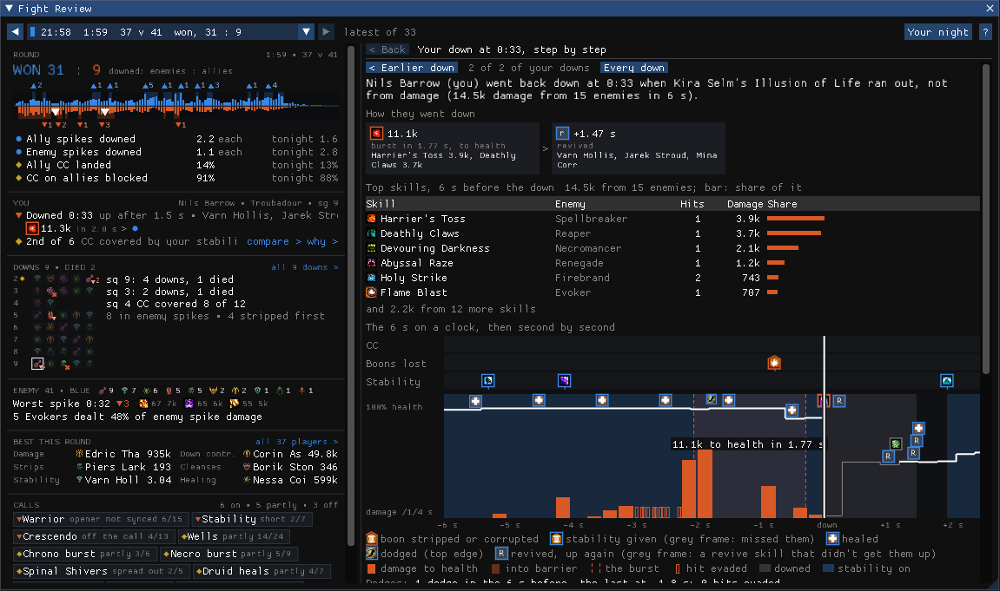
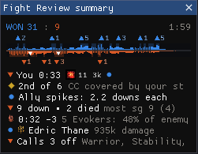
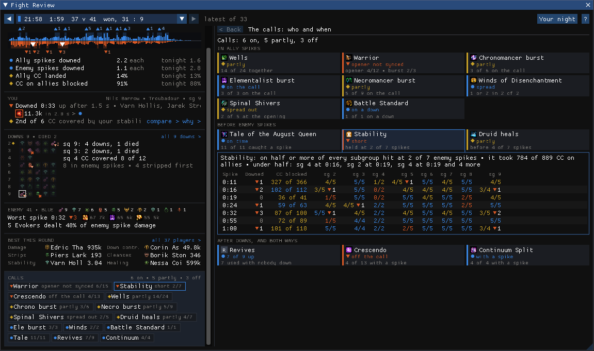

# Fight Review

A Guild Wars 2 addon for WvW. After each fight it reads the log ArcDPS saved and shows what happened: who went
down and why, how the spikes went on both sides, and how you did on your build against others playing the same.

Everything comes from the saved logs, after the fight. Nothing is shown while you fight.

## What it shows

The round's debrief stays at the left; whatever you click in it opens at the right, and Back returns to what was open
before.

- **Round**: the result, both sides' spikes on a strip, and how the round went against the rest of your night.
- **You**: whether you went down and why, and your build's main jobs against the best player on your spec.
- **Downs**: the squad by subgroup; click anyone for their down step by step, and whether a revive came.
- **Enemy** and **Best this round**: the enemy's classes and worst spike, and the best of the squad in each job.
- **Calls**: each key skill your squad used (wells, bursts, Tale of the August Queen, stability, revives...), judged
  by its own rule, with who and when.
- Behind them: both sides' damage over the round with every spike broken down, each subgroup and player, and you next
  to anyone else, skill by skill.

Many views can show this round or the whole evening. Ctrl+Shift+F opens the window; it is also in the Nexus quick
access menu. A small window stays up while you play with the last round in a few lines; right-click it to pick the
lines or its style, or to hide it (the addon's options in Nexus bring it back):

| | |
|---|---|
|  |  |
|  |  |

## Install

Fight Review is in beta. `<GW2>` is your Guild Wars 2 folder. Download the latest `FightReview.dll` from
[Releases](../../releases/latest).

1. **Nexus**: install it from [raidcore.gg/Nexus](https://raidcore.gg/Nexus) into your GW2 folder.
   Check: `<GW2>\d3d11.dll` exists.
2. **ArcDPS**: in game, open Nexus, Addons, search for ArcDPS and install or enable it (or get it from
   [deltaconnected.com/arcdps](https://www.deltaconnected.com/arcdps/)).
   Then turn on WvW logs: ArcDPS options (Alt+Shift+T), Logging, save WvW logs.
   Check: after a fight, a new `.zevtc` file appears in `Documents\Guild Wars 2\addons\arcdps\arcdps.cbtlogs\WvW`.
3. **Healing Stats** (recommended): in Nexus, Addons, search for Healing Stats and install it (or download it from
   its [releases page](https://github.com/Krappa322/arcdps_healing_stats/releases) into `<GW2>\addons`).
   Without it your healing shows as "unknown".
   Check: `<GW2>\addons\arcdps\arcdps.log` has a line with `extensions: healing_stats`.
4. **Fight Review**: put `FightReview.dll` into `<GW2>\addons\`.
   Check: `<GW2>\addons\Nexus\Nexus.log` has `Loaded addon: FightReview.dll`.

Start the game and press Ctrl+Shift+F. At start the addon loads the logs of your last play session, and after that
each new log a few seconds after ArcDPS saves it. Before the first fight, the window shows which log folder it is
watching. It keeps its settings in `<GW2>\addons\FightReview\`.

## FAQ

**What should I look at first after a round?**
The debrief at the left, top to bottom: the result and the three reasons under it, then your own line, the downs and
the calls. Hover anything for the story behind it, click it for the details; "?" at the top right explains each part.

**What should I focus on in You?**
Click your line in the debrief ("why >"). The three cards at the top: your build's main number and the two jobs where
you were furthest behind the best player on your spec. Under them, "Fix first" lists the few things that made the most
difference, each with you and them side by side; click one to see why. The short dark tick under a card's bar is your
usual for the evening, so you can tell a bad round from a bad habit.

**Who am I compared with?**
The best player on the same spec and build in that round (or that evening). If nobody else played your spec that
round, your own best round of the evening on it. "Change" picks someone else.

**How do I find out how someone died?**
Click them in the debrief's downs grid (a row per subgroup, a triangle for each down); Earlier and Later step through
their downs, and "all downs >" lists every down of the round by enemy spike. The tiles under the first line read left
to right: what wore them down, their stability, the last CC, the burst, and whether they got up. The clock below shows
the 6 s before the down: CC, boons they lost and stability they got on lanes at the top, their health and the damage
they took underneath. Hover any moment to see what hit them then.

**What do I get from Compare?**
Open it with "compare >" on your line, or click a name in Best this round or the squad list. Pick two players and a
measure (damage, healing, stability and so on). The first line says who did more and which skills made the difference.
In the skill list, each bar starts at the middle line: to the left where you got more from a skill, to the right where
they did. The columns after it say when each of you cast it and why the numbers differ (fewer casts, less per cast).
The graph at the bottom shows both of you over the round, with the spikes behind.

**How do I read the round's time line?**
Click the result line in the debrief. Ally damage goes up, enemy damage down, a bar per second. Blue bands are ally
spikes, orange ones enemy spikes, with a triangle and the number of downs in each; hover a spike for who went down and
both sides' top skills, click it to break it down. The lane above shows when enemies were invulnerable; the lane under
it shows when allies were (Tale of the August Queen, distortions), with bars for the enemy hits it absorbed. Hover a
lane's name for what it shows. Mark a skill to put an icon on the line for every use, and click its name for a row
per player.

**How do I use a spike breakdown?**
Click a spike on the debrief's strip or the round's time line, or "Break down >" in the list. The top graph is all of
that side's damage around the peak; pick skills (or click one in the list under it) to see when they landed. For ally
spikes, the players at the bottom show whose damage came on time and why someone's didn't. For enemy spikes, "Who
they hit" shows who took the damage, and whether they had stability, were crowd controlled or were invulnerable at the
time.

**How is a spike found?**
A spike is a run of seconds where one side's damage to the other stays at least 1.4 times that side's usual damage
per second and half its highest; a one-second dip that stays above the usual doesn't end it. Its peak is its highest
second. A long push is one spike ("0:02-0:14" in the list). Downs from 3 s before a spike to 4 s after it count for
that spike.

**How is stability judged?**
- CC covered: of the CC that hit your subgroup, how often you had given stability that was still running (TopStats'
  coverage).
- At enemy spikes: in each enemy spike, how much of your subgroup had your stability in the 3 s up to its peak.
- Redundancy: how much of your stability landed on someone who already had another player's (TopStats' definition;
  lower is better, but stacking before a push can be on purpose).

**Can I look at the whole evening?**
Yes: "Your night" at the top right shows the fixes that keep coming back, and "This round / Tonight" switches You,
Compare and the squad view. The arrows and the list at the top pick another round.

## Built on

- [Nexus](https://raidcore.gg/Nexus) by Raidcore: the addon loader, its addon API and Mumble headers.
- [ArcDPS](https://www.deltaconnected.com/arcdps/) by deltaconnected: the combat logs everything here is read from.
- [Healing Stats](https://github.com/Krappa322/arcdps_healing_stats) by Krappa322: healing and barrier in the logs.
- [GW2 Elite Insights](https://github.com/baaron4/GW2-Elite-Insights-Parser): its rules for casts the log doesn't
  record, skill names and icons, and the definitions of shared stats.
- [TopStats](https://github.com/Drevarr/GW2_EI_log_combiner): the reference for WvW stats; stability coverage and
  redundancy follow its definitions.
- [Guild Wars 2 API](https://wiki.guildwars2.com/wiki/API:Main): skills, traits, boons and icons.
- [Snow Crows](https://snowcrows.com/): their WvW builds were the reference for each build's main jobs.
- [Dear ImGui](https://github.com/ocornut/imgui) and [miniz](https://github.com/richgel999/miniz).

Licences and the data generated from these sources are listed in [THIRD_PARTY_NOTICES.md](THIRD_PARTY_NOTICES.md).
Guild Wars 2 is a trademark of ArenaNet, LLC; this project is not affiliated with ArenaNet or NCSOFT.

## Building from source

Visual Studio 2022 with the C++ desktop workload. Run `scripts\build.ps1`; the DLL ends up in `build\release\`.
