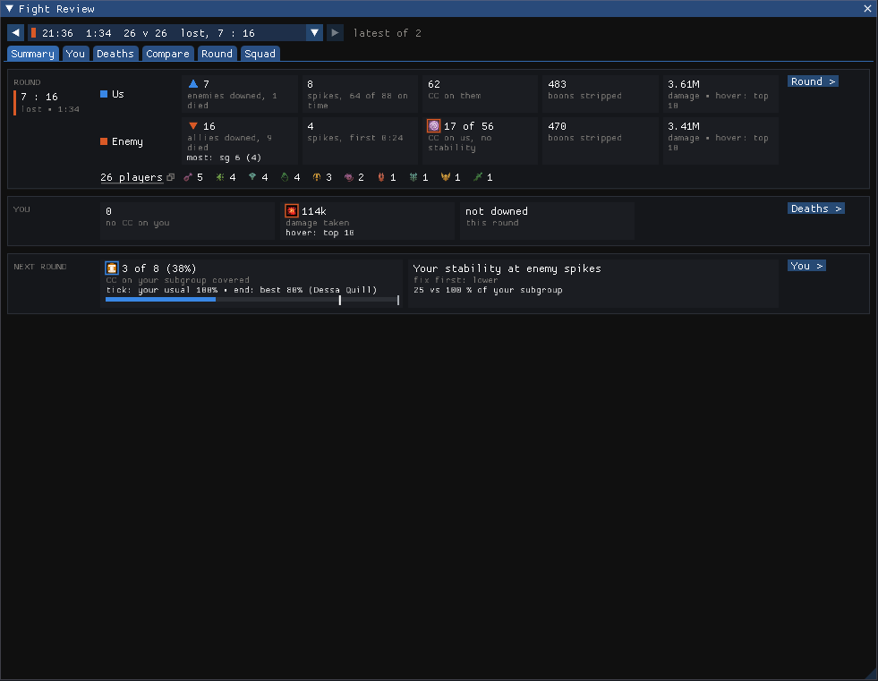
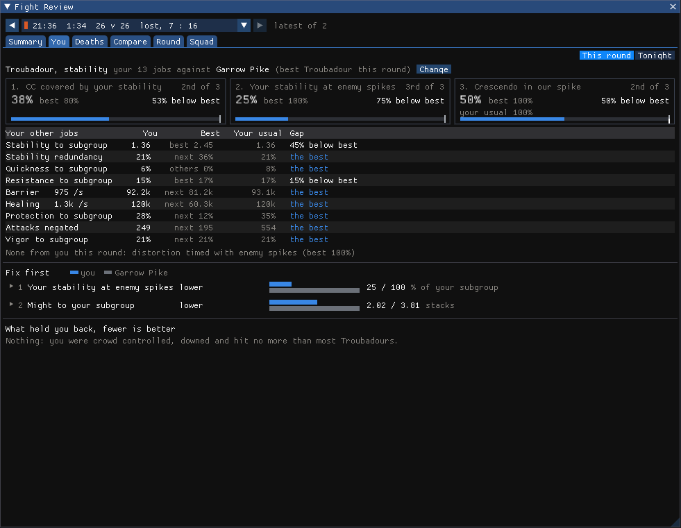
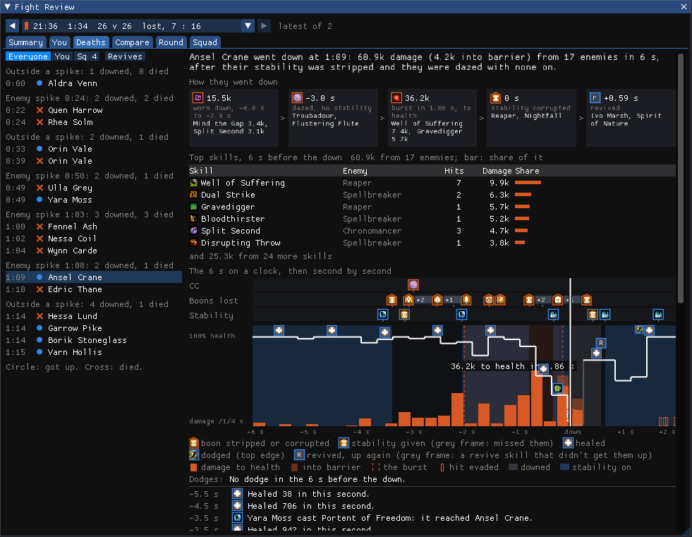
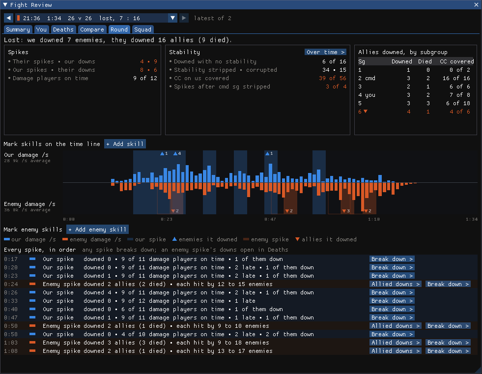
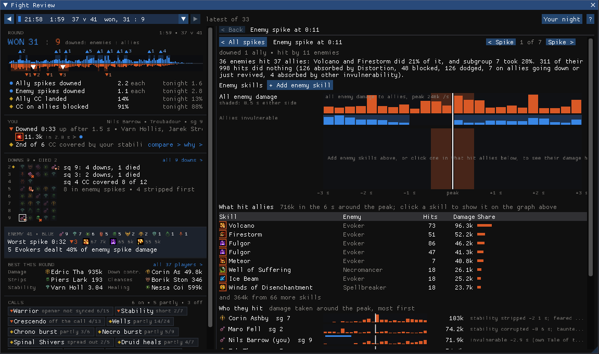

# Fight Review

A Guild Wars 2 addon for WvW. After each fight it reads the log ArcDPS saved and shows what happened: who went
down and why, how the spikes went on both sides, and how you did on your build against others playing the same.

Everything comes from the saved logs, after the fight. Nothing is shown while you fight.

## What it shows

- **Summary**: the round at a glance, and one thing to work on next round.
- **You**: your build's main jobs against the best player on the same spec, and what to fix first.
- **Deaths**: every down in the round, what led to it, and whether a revive came.
- **Round**: both sides' damage over the round, every spike, and a breakdown of each spike.
- **Squad**: each subgroup and player: boons, stability, healing, cleanses, downs.
- **Compare**: you next to another player, skill by skill.

Most tabs can show this round or the whole evening. Ctrl+Shift+F opens the window; it is also in the Nexus quick
access menu.

| | |
|---|---|
|  |  |
|  |  |

## Install

Fight Review is in beta. `<GW2>` is your Guild Wars 2 folder. Download the latest `FightReview.dll` from
[Releases](../../releases/latest).

1. **Nexus**: install it from [raidcore.gg/Nexus](https://raidcore.gg/Nexus) into your GW2 folder.
   Check: `<GW2>\d3d11.dll` exists.
2. **ArcDPS**: in game, open Nexus, Addons, search for ArcDPS and install or enable it (or get it from
   [deltaconnected.com/arcdps](https://www.deltaconnected.com/arcdps/)).
   Then turn on WvW logs: ArcDPS options (Alt+Shift+T), Logging, save WvW logs.
   Check: after a fight, a new `.zevtc` file appears in `Documents\Guild Wars 2\addons\arcdps\arcdps.cbtlogs\WvW`.
3. **Healing Stats** (recommended): in Nexus, Addons, search for Healing Stats and install it (or download it from
   its [releases page](https://github.com/Krappa322/arcdps_healing_stats/releases) into `<GW2>\addons`).
   Without it your healing shows as "unknown".
   Check: `<GW2>\addons\arcdps\arcdps.log` has a line with `extensions: healing_stats`.
4. **Fight Review**: put `FightReview.dll` into `<GW2>\addons\`.
   Check: `<GW2>\addons\Nexus\Nexus.log` has `Loaded addon: FightReview.dll`.

Start the game and press Ctrl+Shift+F. At start the addon loads the logs of your last play session, and after that
each new log a few seconds after ArcDPS saves it. Before the first fight, the window shows which log folder it is
watching. It keeps its settings in `<GW2>\addons\FightReview\`.

## FAQ

**What should I look at first after a round?**
The Summary tab. Its last card names one thing to work on next round; the buttons on each card open the tab with the
details.

**What should I focus on in the You tab?**
The three cards at the top: your build's main number and the two jobs where you were furthest behind the best player
on your spec. Under them, "Fix first" lists the few things that made the most difference, each with you and them side
by side; click one to see why. The short dark tick under a card's bar is your usual for the evening, so you can tell a bad round
from a bad habit.

**Who am I compared with?**
The best player on the same spec and build in that round (or that evening). If nobody else played your spec that
round, your own best round of the evening on it. "Change" picks someone else.

**How do I find out how someone died?**
Open Deaths and pick the down on the left (they are grouped by the enemy spike they fell in). The tiles under the
first line read left to right: what wore them down, their stability, the last CC, the burst, and whether they got up.
The clock below shows the 6 s before the down: CC, boons they lost and stability they got on lanes at the top, their
health and the damage they took underneath. Hover any moment to see what hit them then.

**What do I get from the Compare tab?**
Pick two players and a measure (damage, healing, stability and so on). The first line says who did more and which
skills made the difference. In the skill list, each bar starts at the middle line: to the left where you got more
from a skill, to the right where they did. The columns after it say when each of you cast it and why the numbers
differ (fewer casts, less per cast). The graph at the bottom shows both of you over the round, with the spikes behind.

**How do I read the round's time line?**
Our damage goes up, theirs down, a bar per second. Blue bands are our spikes, orange ones theirs, with a triangle
and the number of downs in each. The thin lanes marked "Invulnerable" show when players of each side were
invulnerable; hover ours to see who used it. Mark a skill to put an icon on the line for every use, and click its
name for a row per player.

**How do I use a spike breakdown?**
"Break down >" on any spike in the list. The top graph is all of that side's damage around the peak; pick skills (or
click one in the list under it) to see when they landed. For our spikes, the players at the bottom show whose damage
came on time and why someone's didn't. For enemy spikes, "Who they hit" shows who took the damage, and whether they
had stability, were crowd controlled or were invulnerable at the time.

**How is a spike found?**
A spike is a second where one side's damage to the other is the highest within 2 s either side, and at least 1.4
times that side's usual damage per second and half its highest. Downs from 3 s before a spike's peak to 4 s after
count for that spike.

**How is stability judged?**
- CC covered: of the CC that hit your subgroup, how often you had given stability that was still running (TopStats'
  coverage).
- At enemy spikes: in each enemy spike, how much of your subgroup had your stability in the 3 s up to its peak.
- Redundancy: how much of your stability landed on someone who already had another player's (TopStats' definition;
  lower is better, but stacking before a push can be on purpose).

**Can I look at the whole evening?**
Yes: "This round / Tonight" at the top right of most tabs. The arrows and the list at the top pick another round.

## Built on

- [Nexus](https://raidcore.gg/Nexus) by Raidcore: the addon loader, its addon API and Mumble headers.
- [ArcDPS](https://www.deltaconnected.com/arcdps/) by deltaconnected: the combat logs everything here is read from.
- [Healing Stats](https://github.com/Krappa322/arcdps_healing_stats) by Krappa322: healing and barrier in the logs.
- [GW2 Elite Insights](https://github.com/baaron4/GW2-Elite-Insights-Parser): its rules for casts the log doesn't
  record, skill names and icons, and the definitions of shared stats.
- [TopStats](https://github.com/Drevarr/GW2_EI_log_combiner): the reference for WvW stats; stability coverage and
  redundancy follow its definitions.
- [Guild Wars 2 API](https://wiki.guildwars2.com/wiki/API:Main): skills, traits, boons and icons.
- [Snow Crows](https://snowcrows.com/): their WvW builds were the reference for each build's main jobs.
- [Dear ImGui](https://github.com/ocornut/imgui) and [miniz](https://github.com/richgel999/miniz).

Licences and the data generated from these sources are listed in [THIRD_PARTY_NOTICES.md](THIRD_PARTY_NOTICES.md).
Guild Wars 2 is a trademark of ArenaNet, LLC; this project is not affiliated with ArenaNet or NCSOFT.

## Building from source

Visual Studio 2022 with the C++ desktop workload. Run `scripts\build.ps1`; the DLL ends up in `build\release\`.
